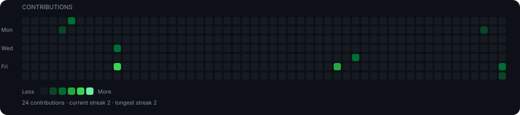

# DISASTRIO

<code>student · builder · learning in public</code>

  

<h3><code>Disastrio@github ~ $ ./contributions.sh</code></h3>

  

<table>
<tr>
<td valign="top">

</td>

<td valign="top">

</td>
</tr>
</table>

 

<code>Disastrio@github ~ $ exit</code>

